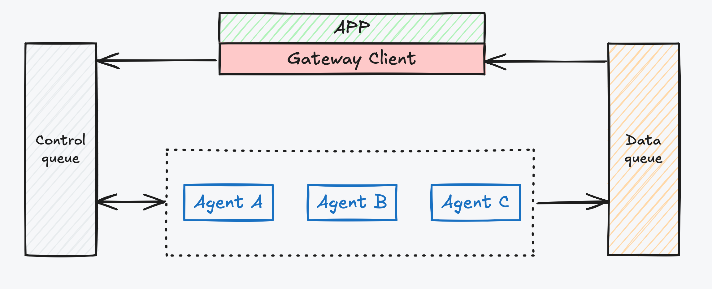

# By-Framework for Java


<div align="center">

[](pom.xml)
[](https://github.com/beyonai/by-framework-java/actions/workflows/ci.yml)
[](pom.xml)
[](pom.xml)
</div>

<div align="center">

[English](README.md) | [中文](README_zh.md)

**Important Links:** [Documentation](https://beyonai.github.io/by-framework-docs) · [Python Version](https://beyonai.github.io/by-framework-python) · [TypeScript Version](https://beyonai.github.io/by-framework-ts)

</div>

## 📖 Overview

**By-Framework** is a distributed, high-performance Agent scheduling engine built on Redis Streams, purpose-built for multi-agent systems.

## Challenges in Traditional Architecture

Traditional AI application architectures often face three critical challenges when dealing with Agent scenarios:

- **Full-link Synchronous Blocking $\rightarrow$ Forced "Manual Monitoring"** — Strong coupling between frontend and backend means tasks are interrupted if the page is closed. Users cannot switch devices or tasks, making workflows fragile to network fluctuations or interruptions.
- **Inability to Support Long-running Tasks $\rightarrow$ System "Constant Accompaniment"** — For reasoning tasks taking minutes or hours, callers must block threads and wait. This leads to gateway timeouts and massive waste of idle compute resources.
- **Inter-Agent Orchestration Recovery Dilemma** — In complex cascaded calls, if a timeout or interruption occurs, it's nearly impossible to accurately resume state. Developers are forced to build extremely complex persistent state machines.

## The By-Framework Solution



By-Framework addresses these issues through an asynchronous architecture with **separated Control and Data Planes**:

- **Instruction Asynchrony**: The APP sends control instructions to the **Control Queue** via the **Gateway Client**. Being asynchronous, the APP never blocks, and backend threads (perfectly utilizing Java 21 virtual threads) are released immediately.
- **Agent Cluster Consumption**: A distributed cluster of **Agents** competitively consumes messages from the control queue. Logical routing (Agent Type) provides native load balancing and elastic scaling.
- **Data Stream Feedback**: During execution, Agents asynchronously push chunks, state changes, and artifacts to the **Data Queue**. The APP listens via the **Gateway Client** for progress, natively supporting ultra-long tasks.
- **Native Orchestration & Resumption**: When an Agent needs to call another Agent, it sends a new instruction to the **Control Queue**. This message-based mechanism allows tasks to release resources while waiting and resume context precisely upon receiving a reply.

## Highlights

- 🚀 **Async & Event-Driven** — Control and data on separate Redis Streams; scale Workers without touching the delivery path
- 🧩 **Modern Java Support** — Built on Java 21 with full support for virtual threads for high-concurrency agent tasks
- 🔌 **Plugin System** — Hot-reloadable plugins with lifecycle hooks, tools, prompts, and sub-agent configs
- 🤝 **Inter-Agent Orchestration** — Built-in `call_agent`, scatter-gather fan-out, and user-in-the-loop patterns
- 🛡️ **Production-Ready** — Competitive consumption, graceful shutdown, message persistence, and execution state tracking

---

## 📋 Contents

- [✨ Features](#-features)
- [🏗️ Architecture](#️-architecture)
- [📦 Installation](#-installation)
- [🚀 Quick Start](#-quick-start)
- [💡 Deep Dive](#-deep-dive)
- [📡 Sending Tasks](#-sending-tasks)
- [🧪 Examples](#-examples)
- [🛠️ Configuration](#️-configuration)

---

## 🏗️ Architecture

The system adopts an event-driven design, highly decoupled:

```
┌─────────────┐       ┌──────────────┐       ┌──────────────┐
│   Client    │──────▶│  Redis Input │──────▶│   Gateway    │
│ (Java SDK)  │       │     MQ       │       │   Worker     │
└─────────────┘       └──────────────┘       └──────┬───────┘
        ▲                                              │
        │                                              │
        │                                              ▼
┌─────────────┐       ┌──────────────┐       ┌──────────────┐
│   Backend   │◀─────│  Redis Data   │◀─────│   Business   │
│  (WebSocket)│       │     MQ       │       │    Logic     │
└─────────────┘       └──────────────┘       └──────────────┘
```

---

## 📦 Installation

### Prerequisites

- Java 21+
- Maven 3.8+
- Redis 7.0+

### Maven Configuration

Add the following dependency to your `pom.xml`:

```xml
<dependency>
    <groupId>com.iwhaleai.byai</groupId>
    <artifactId>by-framework</artifactId>
    <version>0.2.8</version>
</dependency>
```

---

## 🚀 Quick Start

### 1. Create a Simple Agent Worker

Extend `GatewayWorker` and implement the core logic:

```java
import com.iwhaleai.byai.gateway.sdk.core.protocol.AskAgentCommand;
import com.iwhaleai.byai.gateway.sdk.core.protocol.GatewayCommand;
import com.iwhaleai.byai.gateway.sdk.worker.AgentContext;
import com.iwhaleai.byai.gateway.sdk.worker.GatewayWorker;
import com.iwhaleai.byai.gateway.sdk.worker.WorkerRunner;

import java.util.List;

public class MyAssistant extends GatewayWorker {

    public MyAssistant(String workerId) {
        super(workerId);
    }

    @Override
    public List<String> getAgentTypes() {
        return List.of("chat_agent");
    }

    @Override
    public Object processCommand(GatewayCommand command, AgentContext context) {
        if (command instanceof AskAgentCommand askCommand) {
            context.emitChunk("Processing your request...\n");
            return "Task completed";
        }
        return null;
    }

    public static void main(String[] args) {
        new WorkerRunner(new MyAssistant("worker-01")).start();
    }
}
```

---

## 📡 Sending Tasks

```java
ByaiGatewayClient client = new ByaiGatewayClient(RedisClient.getInstance());
client.sendMessage("chat_agent", "session-123", "How is the weather?", "tenant-001", ActionType.ASK_AGENT, null, null, null, null, null);
```

---

## 🛠️ Configuration

| Property | Environment Variable | Description | Default |
| :--- | :--- | :--- | :--- |
| `gateway.redis.host` | `REDIS_HOST` | Redis server address | `localhost` |
| `gateway.redis.port` | `REDIS_PORT` | Redis port | `6379` |
| `gateway.redis.db` | `REDIS_DATABASE` (`REDIS_DB` still works as a deprecated fallback, logs a warning) | Redis database index | `0` |
| `gateway.worker.concurrency` | `WORKER_CONCURRENCY` | Maximum worker concurrency | `50` |

### Redis Cluster mode

`RedisClient.getInstance()` (the default init path used by `ByaiWorker`/`GatewayClient` when no explicit `RedisClient` is passed in) can connect to a Redis Cluster instead of standalone Redis. It stays standalone by default — Cluster mode activates when `REDIS_MODE=cluster` is set explicitly, or simply by setting `REDIS_CLUSTER_HOST` — so existing `gateway.redis.*` users are unaffected.

| Environment Variable | Description | Default |
| :--- | :--- | :--- |
| `REDIS_MODE` | `standalone` or `cluster`; if unset, inferred as `cluster` when `REDIS_CLUSTER_HOST` is set | `standalone` |
| `REDIS_CLUSTER_HOST` | Comma-separated `host:port` list of Cluster nodes, e.g. `h1:6379,h2:6379`; setting it alone is enough to switch to Cluster mode | *(empty)* |
| `REDIS_CLUSTER_NODES` | Same format as `REDIS_CLUSTER_HOST`, used when `REDIS_CLUSTER_HOST` isn't set | *(empty)* |
| `REDIS_USERNAME` / `REDIS_PASSWORD` | Cluster auth credentials | *(none)* |
| `REDIS_KEY_SCHEMA_VERSION` | `v1` or `v2`; required to be `v2` for Cluster mode. If unset, automatically inferred as `v2` when `REDIS_CLUSTER_HOST` is set (an explicit value always wins) | `v1`, or `v2` when `REDIS_CLUSTER_HOST` is set |

Cluster mode requires key schema `v2` — the v1 key layout has no Cluster hash tags and hits `CROSSSLOT` errors under Cluster. Setting `REDIS_CLUSTER_HOST` alone now takes care of this automatically; the older `REDIS_MODE=cluster` + `REDIS_CLUSTER_NODES` combo still requires `REDIS_KEY_SCHEMA_VERSION=v2` to be set explicitly. `RedisClient` fails fast at construction time (no network I/O attempted) if Cluster mode is selected without v2.

Callers that force a fresh instance instead of using the lazy `getInstance()` singleton (e.g. resetting the connection pool on a framework restart) can use `RedisClient.init(RedisConnectionConfig)` — same Standalone/Cluster selection and v2 guard as `getInstance()`, but always replaces the current instance like the positional `init(host, port, ...)` overloads.

---

## 📄 License

This project is licensed under the Apache 2.0 License - see the [LICENSE](LICENSE) file for details.
