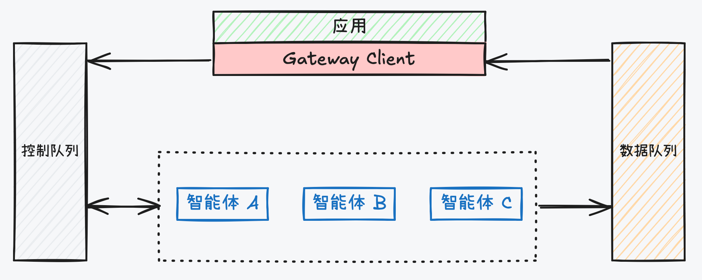

# By-Framework for Java

<div align="center">

[](pom.xml)
[](https://github.com/beyonai/by-framework-java/actions/workflows/ci.yml)
[](pom.xml)
[](pom.xml)
</div>

<div align="center">

[English](README.md) | [中文](README_zh.md)

**重要链接:** [文档](https://beyonai.github.io/by-framework-docs) · [Python 版本](https://beyonai.github.io/by-framework-python) · [TypeScript 版本](https://beyonai.github.io/by-framework-ts)

</div>

## 📖 概述

**By-Framework** 是一个基于 Redis Streams 构建标的分布式高性能 Agent 调度引擎，专为多 Agent 系统设计。

## 传统架构的困境

传统 AI 应用架构在面对 Agent 场景时常面临三大挑战：

- **全链路同步阻塞 $\rightarrow$ 迫使用户“人肉盯看”** — 前端与后端强绑定，页面关闭即任务中断。用户无法跨端切换，工作流极易因网络波动或意外打断而前功尽弃。
- **无法支撑超长任务 $\rightarrow$ 导致系统“全程陪同”** — 面对数分钟甚至小时级的推理，调用方必须持续阻塞线程等待，不仅面临网关超时截断，更造成了严重的计算资源空转与浪费。
- **多 Agent 编排的中断恢复困局** — 在复杂级联调用中，一旦出现超时或中断，系统难以精准定位状态并恢复，开发者往往需自建极其复杂的持久化状态机。

## By-Framework 的方案



By-Framework 通过**控制与数据平面分离**的异步架构解决上述问题：

- **指令异步化**：APP 通过 **Gateway Client** 将用户请求转化为控制指令并投入 **Control Queue**。由于是异步解耦，APP 无需阻塞等待，后端线程（完美配合 Java 21 虚拟线程）立即释放。
- **Agent 集群消费**：分布式的 **Agents** 集群竞争消费控制队列中的消息。通过逻辑寻址（Agent Type）自动实现负载均衡，天然支持动态扩缩容。
- **过程数据回传**：Agent 在执行过程中，将流式文本（Chunk）、状态变更（State）及产物（Artifact）异步推送到 **Data Queue**。APP 通过 **Gateway Client** 实时监听以获取任务进度，从而原生支持超长任务。
- **原生编排与中断恢复**：当 Agent 需要调用其他 Agent（编排）时，它会将新指令发往 **Control Queue**。这种基于消息的机制允许 Agent 在等待期间释放资源，并在收到回复后精准恢复上下文。

## 亮点

- 🚀 **异步与事件驱动** — 控制与数据分离于独立 Redis Stream，Worker 扩缩容与数据投递路径解耦
- 🧩 **现代 Java 支持** — 基于 Java 21 构建，完美支持虚拟线程，满足高并发 Agent 任务需求
- 🔌 **插件系统** — 支持热加载插件机制，提供生命周期钩子、工具、提示词和子 Agent 配置
- 🤝 **多 Agent 编排** — 内置 call_agent、scatter-gather 扇出和人机交互模式
- 🛡️ **生产就绪** — 竞争消费、优雅退出、消息持久化与执行状态追踪

---

## 📋 目录

- [✨ 核心特性](#-核心特性)
- [🏗️ 核心架构](#️-核心架构)
- [📦 安装](#-安装)
- [🚀 快速上手](#-快速上手)
- [💡 深入理解](#-深入理解)
- [📡 发送任务](#-发送任务)
- [🧪 示例](#-示例)
- [🛠️ 配置参考](#️-配置参考)

---

## ✨ 核心特性

- ⚡ **现代 Java 支持**: 基于 Java 21 构建，完美支持虚拟线程，满足高并发 Agent 任务需求。
- 🧩 **高度可扩展**: 内置扩展系统，支持动态注册自定义命令、工具和提示词。
- 📊 **状态管控**: 完善的 `AgentContext` 支持，轻松实现流式输出、状态流转和结果处理。
- 🔄 **解耦架构**: 采用"控制流-数据流分离"设计，支持多语言 Worker 混合集群水平扩展。

---

## 🏗️ 核心架构

系统采用事件驱动设计，高度解耦：

```
┌─────────────┐       ┌──────────────┐       ┌──────────────┐
│   Client    │──────▶│  Redis Input │──────▶│   Gateway    │
│ (Java SDK)  │       │     MQ       │       │   Worker     │
└─────────────┘       └──────────────┘       └──────┬───────┘
        ▲                                              │
        │                                              │
        │                                              ▼
┌─────────────┐       ┌──────────────┐       ┌──────────────┐
│   Backend   │◀─────│  Redis Data   │◀─────│   Business   │
│  (WebSocket)│       │     MQ       │       │    Logic     │
└─────────────┘       └──────────────┘       └──────────────┘
```

---

## 📦 安装

### 前置要求

- Java 21+
- Maven 3.8+
- Redis 7.0+

### Maven 配置

```xml
<dependency>
    <groupId>com.iwhaleai.byai</groupId>
    <artifactId>by-framework</artifactId>
    <version>0.2.8</version>
</dependency>
```

---

## 🚀 快速上手

### 1. 创建一个简单的 Agent Worker

继承 `GatewayWorker` 并实现核心逻辑：

```java
import com.iwhaleai.byai.gateway.sdk.core.protocol.AskAgentCommand;
import com.iwhaleai.byai.gateway.sdk.core.protocol.GatewayCommand;
import com.iwhaleai.byai.gateway.sdk.worker.AgentContext;
import com.iwhaleai.byai.gateway.sdk.worker.GatewayWorker;
import com.iwhaleai.byai.gateway.sdk.worker.WorkerRunner;

import java.util.List;

public class MyAssistant extends GatewayWorker {

    public MyAssistant(String workerId) {
        super(workerId);
    }

    @Override
    public List<String> getAgentTypes() {
        return List.of("chat_agent");
    }

    @Override
    public Object processCommand(GatewayCommand command, AgentContext context) {
        if (command instanceof AskAgentCommand askCommand) {
            context.emitChunk("正在处理您的请求...\n");
            return "任务完成";
        }
        return null;
    }

    public static void main(String[] args) {
        new WorkerRunner(new MyAssistant("worker-01")).start();
    }
}
```

### 挂起前后的 `header.metadata`

Agent 一旦挂起（`askUser`，或 `waitForReply` 的 `callAgent`）就会结束本次执行，
之后由一条 `ResumeCommand` 重新拉起。metadata 在两个方向上被还原，
规则是**刻意不同**的：

- **你的 handler 读到的**（恢复后那次调用的 `command.header().metadata()`）：
  本次执行**最初被派发时**携带的 metadata，与唤醒消息自身的 metadata 合并，
  同名键以唤醒消息为准（它是更新、更具体的那一跳）。
  没有这层还原的话，你被派发时收到的一切会在第一次挂起时全部消失。
- **你的调用方收到的**：**它**派发你时带的那份 metadata，整体替换，
  再叠加你在返回值 `metadata` 里给出的内容。唤醒你的那条消息只是那一跳的
  管道数据，永远不会流到你的调用方——尽管你自己看得到它。

三个框架注入的键 —— `trace_parent_span_id`、`framework_parent_span_id`、
`langfuse_parent_observation_id` —— 始终描述当前这一跳，不会从记录里还原。

挂起中的执行**不会**立刻回复调用方：handler 为了 unwind 而返回的值不是结果，
发出去会把调用方提前唤醒，并烧掉它唯一在等的那条回复。真正的结果在执行恢复并
完成时才发出。例外是终态——handler 在派发后到达 COMPLETED/FAILED/CANCELLED
说明它真的完成了、不会再被 resume，此时必须立即回复。

---

### 挂起调用方的存活判定

用 `waitForReply` 派发的调用方会**结束本次执行**，之后由一条 `ResumeCommand`
重新拉起。它没有存活的协程，所以内部无法给自己超时 —— 子 worker 猝死、挂死、
回调丢失时，调用方会永远等下去。边界来自外部：分片的等待索引加一个后台扫描，
两者都随 worker 启动。

`callAgent` 新增可选的 `replyTimeoutMs`（默认 1 小时）；`askUser` 用会话 TTL。
挂起的调用方落库为 `WAITING_AGENT` 或 `WAITING_USER`，因此 `QUEUED` 现在只表示
"尚未被捡起"。

两个独立开关：

| 环境变量 | 默认 | 作用 |
|---|---|---|
| `BY_FRAMEWORK_WAIT_PRUNE_ENABLED` | **开** | 删除老到不可能再审讯成功的等待条目。它不做任何决策，所以无需 opt-in —— 而且除了它之外没有任何东西会移除条目，不开就会每个未回复的调用泄漏一条 |
| `BY_FRAMEWORK_WAIT_SWEEPER_ENABLED` | **关** | 补偿：合成一条已死 callee 本该发出的回复。这是整个特性的回滚开关 |
| `BY_FRAMEWORK_WAIT_CANCEL_ON_TIMEOUT` | 开 | 在调用方已被解决之后，额外请求超时的 callee 停止 |

开启补偿后，以下情形调用方会被解决：callee 的 worker 猝死
（`CHILD_WORKER_LOST`）、从未被捡起（`CHILD_NEVER_STARTED`）、
或超过一个宽松的绝对上限（`CHILD_TIMEOUT`）。
若 callee 其实已完成、只是回复丢了，会取回并转发它**真实**的已存结果
（`REPLY_LOST_RECOVERED`），而不是给一个实际成功的任务编造失败。

索引、member 编码与分片函数是**跨 SDK 契约**：Python、TypeScript 与 Java
读写同一批结构，所以 Python worker 的扫描已经能补偿 Java 登记的等待，反之亦然。

---

## 📡 发送任务

```java
ByaiGatewayClient client = new ByaiGatewayClient(RedisClient.getInstance());
client.sendMessage("chat_agent", "session-123", "北京今天天气如何？", "tenant-001", ActionType.ASK_AGENT, null, null, null, null, null);
```

---

## 🛠️ 配置参考

| 配置项 | 环境变量 | 描述 | 默认值 |
| :--- | :--- | :--- | :--- |
| `gateway.redis.host` | `REDIS_HOST` | Redis 服务器地址 | `localhost` |
| `gateway.redis.port` | `REDIS_PORT` | Redis 端口 | `6379` |
| `gateway.redis.db` | `REDIS_DATABASE`（`REDIS_DB` 作为过期兼容 fallback 仍可用，会打印一条 warning 日志） | Redis 数据库索引 | `0` |
| `gateway.worker.concurrency` | `WORKER_CONCURRENCY` | Worker 最大并发数 | `50` |

### Redis Cluster 模式

`RedisClient.getInstance()`（`ByaiWorker`/`GatewayClient` 在未显式传入 `RedisClient` 时使用的默认初始化路径）可以连接 Redis Cluster 而非单机 Redis。默认仍为单机模式——设置 `REDIS_MODE=cluster`，或者只配置 `REDIS_CLUSTER_HOST`，都会启用 Cluster 模式，因此现有 `gateway.redis.*` 用户不受影响。

| 环境变量 | 描述 | 默认值 |
| :--- | :--- | :--- |
| `REDIS_MODE` | `standalone` 或 `cluster`；未设置时，若配置了 `REDIS_CLUSTER_HOST` 则自动推断为 `cluster` | `standalone` |
| `REDIS_CLUSTER_HOST` | 逗号分隔的 `host:port` 节点列表，例如 `h1:6379,h2:6379`；只要配置了这个变量就足以切换到 Cluster 模式 | *(空)* |
| `REDIS_CLUSTER_NODES` | 格式同 `REDIS_CLUSTER_HOST`，在未设置 `REDIS_CLUSTER_HOST` 时使用 | *(空)* |
| `REDIS_USERNAME` / `REDIS_PASSWORD` | Cluster 认证凭据 | *(无)* |
| `REDIS_KEY_SCHEMA_VERSION` | `v1` 或 `v2`；Cluster 模式要求为 `v2`。未显式设置时，只要配置了 `REDIS_CLUSTER_HOST` 就会自动推断为 `v2`（显式设置的值始终优先） | `v1`，配置了 `REDIS_CLUSTER_HOST` 时为 `v2` |

Cluster 模式要求 key schema 为 `v2`——v1 key 格式没有 Cluster hash tag，在 Cluster 下会触发 `CROSSSLOT` 错误。现在只要设置了 `REDIS_CLUSTER_HOST`，这一项会自动处理好；走老式 `REDIS_MODE=cluster` + `REDIS_CLUSTER_NODES` 组合的用户，仍然需要显式设置 `REDIS_KEY_SCHEMA_VERSION=v2`。若选择 Cluster 模式但最终 key schema 不是 v2，`RedisClient` 会在构造时立即失败（不会尝试任何网络 I/O）。

需要强制刷新实例而非使用 `getInstance()` 懒加载单例的调用方（例如在框架重启时重置连接池），可以使用 `RedisClient.init(RedisConnectionConfig)`——与 `getInstance()` 相同的单机/集群选择逻辑和 v2 校验，但会像 `init(host, port, ...)` 系列重载一样，始终替换当前实例。

---

## 📄 许可证

本项目采用 Apache 2.0 许可证 - 查看 [LICENSE](LICENSE) 文件了解详情。
